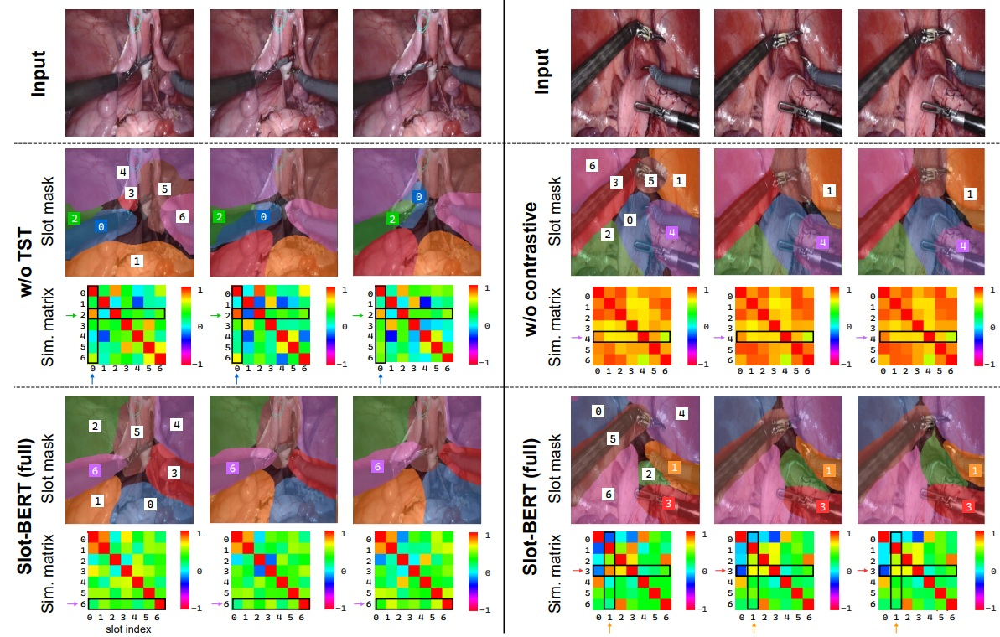

# Slot-BERT: Self-supervised Object Discovery in Surgical Video

Official implementation of:

**Slot-BERT: Self-supervised Object Discovery in Surgical Video**  
Guiqiu Liao, Matjaz Jogan, Marcel Hussing, Kenta Nakahashi,  
Kazuhiro Yasufuku, Amin Madani, Eric Eaton, Daniel A. Hashimoto  

Journal paper (MedIA): https://doi.org/10.1016/j.media.2026.103972

We also released code for our alternative approach [Xslot](https://github.com/PCASOlab/Xslot).

---

## Overview

Slot-BERT is a self-supervised object-centric representation learning framework for surgical video. 
 

Unlike conventional recurrent slot-based video models, Slot-BERT introduces:

- Bidirectional long-range temporal reasoning using a Transformer
- Masked slot modeling inspired by BERT
- Slot contrastive learning for orthogonality
- Future slot prediction for long video scalability
- Efficient latent-space reasoning without optical flow or depth cues

The model achieves strong unsupervised segmentation, transfer learning, and zero-shot generalization across multiple surgical datasets.

<p align="center">
  
</p>

---

## Key Contributions

- Bidirectional Temporal Slot Transformer (TST) for long-range coherence
- Masked slot modeling for temporal reasoning
- Slot contrastive loss for disentanglement
- Future slot prediction mechanism for scalable inference
- Superior performance across MICCAI, Cholec80, EndoVis, and Thoracic datasets

---
 
### Datasets

Support these 3 dataset, the demo is able to train with sampled data (within folder [`src/Data_samples`](./src/Data_samples)), the full curated data is available thourgh the following links:
- **Abdominal dataset:** [Download](https://upenn.box.com/s/493licnenrssjukuvok5zkvc5cqmx1nh)
- **Thoracic dataset:** [Please fill in this data request form](https://upenn.co1.qualtrics.com/jfe/form/SV_ewBhqo82j65YXtQ)
- **Cholec dataset:** [Download](https://upenn.box.com/s/ree79lv9fbibjbs2b8mkwzz207oqu6jj)
 

## Public Release Scope

This release entrypoint focuses on **Slot-BERT** training with the **contrastive slot loss** only.

- Use `main.py` at the repository root as the starting script.
- The script reuses internals from `0_full_code_back/` but exposes a narrowed training path for release.

### Run

```bash
python main.py
```

Optional arguments:

```bash
python main.py --mode train_cholec --contrastive-temp 1.0 --sim-threshold 0.9
```


### Coming soon
Pretrained weights on different datasets.

Useful prompts to easily navigate the code through LLM programming agents.

## Citation

If you use this codebase, please cite:

```
@article{liao2026slot,
  title={Slot-BERT: self-supervised object discovery in surgical video},
  author={Liao, Guiqiu and Jogan, Matja{\v{z}} and Hussing, Marcel and Nakahashi, Kenta and Yasufuku, Kazuhiro and Madani, Amin and Hashimoto, Daniel A and others},
  journal={Medical Image Analysis},
  pages={103972},
  year={2026},
  publisher={Elsevier}
}
```

## License

This project is for academic research purposes only.
